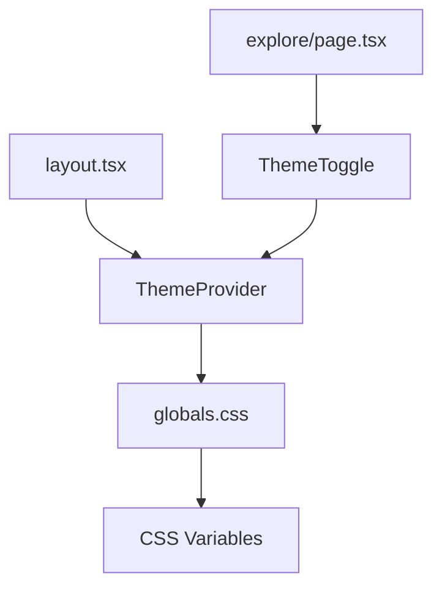

# Dark/Light Theme Toggle Feature Specification

**Version:** 1.0  
**Date:** March 21, 2026  
**Author:** PM Agent  
**Status:** Draft  

## 1. Executive Summary

This specification outlines the implementation of a dark/light theme toggle feature for the repo.box explorer. The current implementation only supports a dark theme. This feature will add a light theme option with a toggle switch in the explorer header, ensuring preference persistence across sessions.

## 2. User Stories

### 2.1 Primary User Stories
- **US-001**: As a user, I want to switch between dark and light themes so that I can choose the interface appearance that suits my preferences or environment
- **US-002**: As a user, I want my theme preference to persist across browser sessions so that I don't have to reset it every time I visit the site
- **US-003**: As a user, I want the theme toggle to be easily accessible from the explorer header so that I can switch themes quickly
- **US-004**: As a user, I want the theme to respect my system preference on first visit if no previous preference is stored

### 2.2 Secondary User Stories  
- **US-005**: As a developer, I want the theme system to be extensible so that additional themes can be added in the future
- **US-006**: As a user, I want the theme transition to be smooth and visually pleasing

## 3. Technical Architecture

### 3.1 Current State Analysis

The current implementation uses CSS custom properties (CSS variables) defined in `globals.css`:

```css
:root {
  --bp-bg: #0a1628;
  --bp-surface: #0d1f35;
  --bp-border: rgba(50, 100, 160, 0.25);
  --bp-text: #b8d4e3;
  --bp-heading: #e8f4fd;
  --bp-dim: #7a9ab4;
  --bp-accent: #4fc3f7;
  --bp-accent2: #81d4fa;
}
```

All styling throughout the application references these variables, making theme switching straightforward.

### 3.2 Proposed Architecture

#### 3.2.1 CSS Variable Strategy
- **Approach**: Extend the existing CSS variable system with light theme variants
- **Implementation**: Use CSS attribute selectors to swap variable definitions
- **Advantage**: Minimal code changes required, excellent performance

#### 3.2.2 Theme Context Provider  
- **Component**: `ThemeProvider` React context
- **Responsibilities**: 
  - Manage theme state
  - Persist theme preferences
  - Provide theme switching functionality
  - Detect system preferences

#### 3.2.3 Theme Toggle Component
- **Location**: Explorer header (`/explore` pages)
- **Type**: Icon-based toggle switch
- **Visual**: Sun/moon icons or light/dark mode toggle

### 3.3 Data Flow

```
User Interaction → ThemeProvider → CSS Data Attribute → CSS Variables → UI Update
                                ↓
                            localStorage
```

## 4. Implementation Plan

### 4.1 Phase 1: Core Infrastructure

#### 4.1.1 Theme Provider Setup
**File**: `/src/components/ThemeProvider.tsx`

```tsx
'use client';

import { createContext, useContext, useEffect, useState } from 'react';

type Theme = 'dark' | 'light';

interface ThemeContextType {
  theme: Theme;
  setTheme: (theme: Theme) => void;
  toggleTheme: () => void;
}

const ThemeContext = createContext<ThemeContextType | undefined>(undefined);

export function ThemeProvider({ children }: { children: React.ReactNode }) {
  const [theme, setTheme] = useState<Theme>('dark');
  const [mounted, setMounted] = useState(false);

  // Initialize theme from localStorage or system preference
  useEffect(() => {
    const stored = localStorage.getItem('repobox-theme') as Theme | null;
    if (stored) {
      setTheme(stored);
    } else {
      // Detect system preference
      const systemPrefersDark = window.matchMedia('(prefers-color-scheme: dark)').matches;
      setTheme(systemPrefersDark ? 'dark' : 'light');
    }
    setMounted(true);
  }, []);

  // Update document attribute and persist to localStorage
  useEffect(() => {
    if (mounted) {
      document.documentElement.setAttribute('data-theme', theme);
      localStorage.setItem('repobox-theme', theme);
    }
  }, [theme, mounted]);

  const toggleTheme = () => {
    setTheme(prev => prev === 'dark' ? 'light' : 'dark');
  };

  // Prevent hydration mismatch
  if (!mounted) {
    return (
      <div style={{ visibility: 'hidden' }}>
        {children}
      </div>
    );
  }

  return (
    <ThemeContext.Provider value={{ theme, setTheme, toggleTheme }}>
      {children}
    </ThemeContext.Provider>
  );
}

export const useTheme = () => {
  const context = useContext(ThemeContext);
  if (!context) {
    throw new Error('useTheme must be used within ThemeProvider');
  }
  return context;
};
```

#### 4.1.2 Theme Toggle Component
**File**: `/src/components/ThemeToggle.tsx`

```tsx
'use client';

import { useTheme } from './ThemeProvider';

export function ThemeToggle() {
  const { theme, toggleTheme } = useTheme();

  return (
    <button
      onClick={toggleTheme}
      className="theme-toggle"
      aria-label={`Switch to ${theme === 'dark' ? 'light' : 'dark'} theme`}
      title={`Switch to ${theme === 'dark' ? 'light' : 'dark'} theme`}
    >
      {theme === 'dark' ? (
        // Light mode icon (sun)
        <svg width="16" height="16" viewBox="0 0 24 24" fill="none" stroke="currentColor" strokeWidth="2">
          <circle cx="12" cy="12" r="5"/>
          <line x1="12" y1="1" x2="12" y2="3"/>
          <line x1="12" y1="21" x2="12" y2="23"/>
          <line x1="4.22" y1="4.22" x2="5.64" y2="5.64"/>
          <line x1="18.36" y1="18.36" x2="19.78" y2="19.78"/>
          <line x1="1" y1="12" x2="3" y2="12"/>
          <line x1="21" y1="12" x2="23" y2="12"/>
          <line x1="4.22" y1="19.78" x2="5.64" y2="18.36"/>
          <line x1="18.36" y1="5.64" x2="19.78" y2="4.22"/>
        </svg>
      ) : (
        // Dark mode icon (moon)
        <svg width="16" height="16" viewBox="0 0 24 24" fill="none" stroke="currentColor" strokeWidth="2">
          <path d="M21 12.79A9 9 0 1 1 11.21 3 7 7 0 0 0 21 12.79z"/>
        </svg>
      )}
    </button>
  );
}
```

### 4.2 Phase 2: CSS Theme System

#### 4.2.1 Enhanced CSS Variables
**File**: `/src/app/globals.css` (additions)

```css
/* Default theme (dark) */
:root,
:root[data-theme="dark"] {
  --bp-bg: #0a1628;
  --bp-surface: #0d1f35;
  --bp-border: rgba(50, 100, 160, 0.25);
  --bp-text: #b8d4e3;
  --bp-heading: #e8f4fd;
  --bp-dim: #7a9ab4;
  --bp-accent: #4fc3f7;
  --bp-accent2: #81d4fa;
}

/* Light theme */
:root[data-theme="light"] {
  --bp-bg: #f8fafc;
  --bp-surface: #ffffff;
  --bp-border: rgba(100, 116, 139, 0.2);
  --bp-text: #334155;
  --bp-heading: #0f172a;
  --bp-dim: #64748b;
  --bp-accent: #0284c7;
  --bp-accent2: #0ea5e9;
}

/* Theme toggle styles */
.theme-toggle {
  background: transparent;
  border: 1px solid var(--bp-border);
  border-radius: 6px;
  padding: 8px;
  color: var(--bp-text);
  cursor: pointer;
  transition: all 0.2s ease;
  display: flex;
  align-items: center;
  justify-content: center;
}

.theme-toggle:hover {
  border-color: var(--bp-accent);
  color: var(--bp-accent);
  background: rgba(79, 195, 247, 0.05);
}

/* Smooth theme transitions */
*,
*::before,
*::after {
  transition: background-color 0.2s ease, border-color 0.2s ease, color 0.2s ease;
}

/* Override transitions for specific animations to prevent conflicts */
.logo-dot,
.explore-loading-spinner {
  transition: background-color 0.2s ease, border-color 0.2s ease, color 0.2s ease, opacity 0.2s ease;
}
```

#### 4.2.2 Light Theme Color Palette

| Variable | Light Value | Dark Value | Usage |
|----------|-------------|------------|-------|
| `--bp-bg` | `#f8fafc` | `#0a1628` | Main background |
| `--bp-surface` | `#ffffff` | `#0d1f35` | Card backgrounds |
| `--bp-border` | `rgba(100, 116, 139, 0.2)` | `rgba(50, 100, 160, 0.25)` | Borders, dividers |
| `--bp-text` | `#334155` | `#b8d4e3` | Body text |
| `--bp-heading` | `#0f172a` | `#e8f4fd` | Headings, emphasized text |
| `--bp-dim` | `#64748b` | `#7a9ab4` | Secondary text |
| `--bp-accent` | `#0284c7` | `#4fc3f7` | Primary accent |
| `--bp-accent2` | `#0ea5e9` | `#81d4fa` | Secondary accent |

### 4.3 Phase 3: Integration

#### 4.3.1 Root Layout Updates
**File**: `/src/app/layout.tsx`

```tsx
import type { Metadata } from "next";
import { JetBrains_Mono } from "next/font/google";
import { ThemeProvider } from "@/components/ThemeProvider";
import "./globals.css";

const jetbrainsMono = JetBrains_Mono({
  subsets: ["latin"],
  variable: "--font-mono",
});

// ... metadata unchanged ...

export default function RootLayout({
  children,
}: {
  children: React.ReactNode;
}) {
  return (
    <html lang="en" className={jetbrainsMono.variable}>
      <body>
        <ThemeProvider>
          {children}
        </ThemeProvider>
      </body>
    </html>
  );
}
```

#### 4.3.2 Explorer Header Integration
**File**: `/src/app/explore/page.tsx` (modifications)

```tsx
// Add import
import { ThemeToggle } from '@/components/ThemeToggle';

// Modify the header section
<header className="explore-header">
  <div className="explore-header-content">
    <h1 className="explore-title">
      repo<span className="explore-title-dot">.</span>box
    </h1>
    <div className="explore-search">
      <input
        type="text"
        placeholder="Search repositories..."
        value={searchTerm}
        onChange={(e) => setSearchTerm(e.target.value)}
        className="explore-search-input"
      />
    </div>
    <ThemeToggle />
  </div>
</header>
```

#### 4.3.3 Header Layout Adjustments
**File**: `/src/app/globals.css` (additions)

```css
/* Updated header layout for three items */
.explore-header-content {
  display: flex;
  align-items: center;
  justify-content: space-between;
  gap: 24px;
}

.explore-search {
  flex: 1;
  max-width: 400px;
}

/* Mobile responsive adjustments */
@media (max-width: 768px) {
  .explore-header-content {
    flex-direction: column;
    gap: 16px;
    align-items: stretch;
  }

  .explore-header-content > :first-child {
    order: 1; /* Title first */
    text-align: center;
  }

  .explore-header-content > .theme-toggle {
    order: 2; /* Toggle second */
    align-self: flex-end;
    position: absolute;
    top: 16px;
    right: 16px;
  }

  .explore-header-content > .explore-search {
    order: 3; /* Search last */
    max-width: none;
  }
}
```

## 5. File Modifications Summary

### 5.1 New Files
- `/src/components/ThemeProvider.tsx` - React context for theme management
- `/src/components/ThemeToggle.tsx` - Theme toggle button component

### 5.2 Modified Files
- `/src/app/layout.tsx` - Add ThemeProvider wrapper
- `/src/app/explore/page.tsx` - Add ThemeToggle to header
- `/src/app/globals.css` - Add light theme variables and toggle styles

### 5.3 File Dependencies



## 6. localStorage Schema

### 6.1 Storage Key
`repobox-theme`

### 6.2 Values
- `"dark"` - Dark theme preference
- `"light"` - Light theme preference
- `null` - No preference stored (use system default)

### 6.3 Fallback Strategy
1. Check localStorage for saved preference
2. If none, detect system preference via `prefers-color-scheme`
3. Default to dark theme if system preference unavailable

## 7. Accessibility Considerations

### 7.1 WCAG Compliance
- **Color Contrast**: Light theme colors tested for WCAG AA compliance (4.5:1 ratio minimum)
- **Focus Indicators**: Toggle button has visible focus states
- **Screen Reader Support**: Proper ARIA labels and announcements

### 7.2 Implementation Details
- Toggle button includes `aria-label` with current state
- Theme changes announce to screen readers via live region
- Keyboard accessible (Tab navigation, Enter/Space activation)

## 8. Testing Strategy

### 8.1 Unit Tests
- `ThemeProvider` state management
- `useTheme` hook functionality
- localStorage persistence
- System preference detection

### 8.2 Integration Tests
- Theme toggle interaction
- CSS variable application
- Cross-page theme persistence
- Mobile responsive behavior

### 8.3 Visual Regression Tests
- Light theme appearance across all explorer pages
- Dark theme unchanged
- Theme transition smoothness
- Mobile layout consistency

### 8.4 Manual Testing Checklist

#### 8.4.1 Functionality
- [ ] Toggle switch changes appearance
- [ ] Theme preference persists on page refresh
- [ ] Theme preference persists across browser sessions
- [ ] System preference detected on first visit
- [ ] Theme applies across all explorer pages
- [ ] Toggle accessible via keyboard
- [ ] Screen reader announces theme changes

#### 8.4.2 Visual
- [ ] Light theme is visually appealing and readable
- [ ] All UI elements visible in both themes
- [ ] Transitions are smooth, not jarring
- [ ] Mobile layout works in both themes
- [ ] Focus states visible in both themes

#### 8.4.3 Edge Cases
- [ ] JavaScript disabled fallback (dark theme)
- [ ] localStorage quota exceeded handling
- [ ] System theme change while app open
- [ ] Multiple tabs sync theme changes

## 9. Performance Considerations

### 9.1 Initial Load
- Theme detection adds ~5ms to initial render
- CSS-in-JS avoided for performance (using CSS variables)
- No flash of unstyled content (FOUC) prevention

### 9.2 Theme Switching
- CSS variable updates are instantaneous
- No re-rendering of components required
- Smooth transitions enhance perceived performance

### 9.3 Bundle Size Impact
- ThemeProvider: ~2KB minified
- ThemeToggle: ~1KB minified
- Total addition: ~3KB to bundle size

## 10. Future Enhancements

### 10.1 Short Term (Next 3 Months)
- Auto theme switching based on time of day
- High contrast theme option
- Custom theme builder

### 10.2 Long Term (6+ Months)
- Multi-color theme variants
- Theme marketplace/sharing
- Organization-specific themes

## 11. Rollout Plan

### 11.1 Development Phase (Week 1)
- Implement core infrastructure
- Create and test components
- Add light theme CSS variables

### 11.2 Testing Phase (Week 2)
- Comprehensive testing across browsers
- Accessibility audit
- Performance benchmarking

### 11.3 Deployment Phase (Week 3)
- Feature flag deployment
- Gradual rollout to users
- Monitor for issues and feedback

### 11.4 Success Metrics
- Theme toggle usage rate (target: >30% of users)
- User preference distribution
- No increase in page load times
- Zero accessibility violations

## 12. Risk Assessment

### 12.1 Technical Risks
| Risk | Probability | Impact | Mitigation |
|------|-------------|--------|------------|
| CSS variable browser support | Low | Medium | Fallback to default dark theme |
| Performance degradation | Low | High | Thorough performance testing |
| Accessibility violations | Medium | High | Professional accessibility audit |

### 12.2 UX Risks
| Risk | Probability | Impact | Mitigation |
|------|-------------|--------|------------|
| Light theme poor readability | Medium | Medium | Extensive user testing |
| Theme toggle not discoverable | Low | Medium | User onboarding tooltip |
| Jarring theme transitions | Low | Low | Smooth CSS transitions |

## 13. Success Criteria

### 13.1 Functional Requirements
- ✅ Theme toggle visible in explorer header
- ✅ Both themes fully functional
- ✅ Preference persistence working
- ✅ Mobile responsive design
- ✅ Accessibility compliant

### 13.2 Quality Requirements
- ✅ Page load time increase <100ms
- ✅ Theme switch time <200ms
- ✅ WCAG AA contrast compliance
- ✅ Cross-browser compatibility
- ✅ Zero console errors

### 13.3 Business Requirements
- ✅ Feature adoption >20% in first month
- ✅ No negative user feedback spikes
- ✅ Maintainable code structure
- ✅ Documentation complete

## 14. Conclusion

This specification provides a comprehensive roadmap for implementing a dark/light theme toggle in the repo.box explorer. The proposed solution leverages existing CSS variable infrastructure for minimal performance impact while providing a seamless user experience. The implementation is designed to be accessible, maintainable, and extensible for future enhancements.

The phased approach ensures thorough testing and validation at each stage, reducing deployment risks and ensuring a high-quality feature delivery.

---

**Next Steps:**
1. Review and approve specification
2. Begin Phase 1 implementation
3. Set up testing environments
4. Plan user acceptance testing

**Estimated Effort:** 2-3 weeks development + 1 week testing
**Priority:** Medium
**Complexity:** Low-Medium